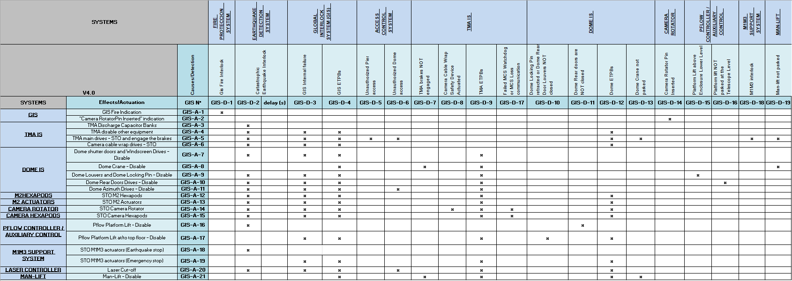

# PAS Connect Interface

<table>
<colgroup>
<col style="width: 31%" />
<col style="width: 68%" />
</colgroup>
<tbody>
<tr class="odd">
<td><blockquote>
<p>Requested by:</p>
</blockquote></td>
<td><blockquote>
<p><strong>LSST</strong></p>
</blockquote></td>
</tr>
<tr class="even">
<td><blockquote>
<p>Code / Version:</p>
</blockquote></td>
<td><blockquote>
<p>7186_GIS_0010 / 1.0</p>
</blockquote></td>
</tr>
<tr class="odd">
<td><blockquote>
<p>Editor:</p>
</blockquote></td>
<td><blockquote>
<p>F. Javier López</p>
</blockquote></td>
</tr>
<tr class="even">
<td><blockquote>
<p>Approved by:</p>
</blockquote></td>
<td><blockquote>
<p>Ismael Ruiz de Argandoña</p>
</blockquote></td>
</tr>
<tr class="odd">
<td><blockquote>
<p>Date:</p>
</blockquote></td>
<td><blockquote>
<p>02/09/2022</p>
</blockquote></td>
</tr>
</tbody>
</table>

## Document history

<table>
<colgroup>
<col style="width: 14%" />
<col style="width: 14%" />
<col style="width: 18%" />
<col style="width: 53%" />
</colgroup>
<tbody>
<tr class="odd">
<td><strong>VERSION</strong></td>
<td><strong>DATE</strong></td>
<td><strong>EDITOR</strong></td>
<td><strong>COMMENTS</strong></td>
</tr>
<tr class="even">
<td>1.0</td>
<td>2022/09/02</td>
<td>F. Javier López</td>
<td><blockquote>
<p><em>Initial release</em></p>
</blockquote></td>
</tr>
<tr class="odd">
<td></td>
<td></td>
<td></td>
<td></td>
</tr>
<tr class="even">
<td></td>
<td></td>
<td></td>
<td></td>
</tr>
<tr class="odd">
<td></td>
<td></td>
<td></td>
<td></td>
</tr>
<tr class="even">
<td></td>
<td></td>
<td></td>
<td></td>
</tr>
</tbody>
</table>

<table>
<colgroup>
<col style="width: 15%" />
<col style="width: 84%" />
</colgroup>
<thead>
<tr class="header">
<th><strong>Acronyms</strong></th>
<th><strong>Definition</strong></th>
</tr>
<tr class="odd">
<th><p>AFE / AcFiEa</p>
<p>ETPB</p></th>
<th><p>Access Fire Earthquake</p>
<p>Emergency trip pushbutton</p></th>
</tr>
<tr class="header">
<th>GIS</th>
<th>Global Interlock System</th>
</tr>
<tr class="odd">
<th>HMI</th>
<th>Human Machine Interface</th>
</tr>
<tr class="header">
<th><p>IS</p>
<p>LAS</p></th>
<th><p>Interlock System</p>
<p>LASER</p></th>
</tr>
<tr class="odd">
<th><p>LSST</p>
<p>UI</p></th>
<th><p>Large Synoptic Survey Telescope</p>
<p>User Interface</p></th>
</tr>
</thead>
<tbody>
</tbody>
</table>

## Introduction

This document contains the signals communicated between the different CPUs that make up the telescope\'s safety system.

```{uml}
@startuml
skinparam componentStyle rectangle

component GIS
component M1M3
component DOME
component TMA
component AUX

GIS <-d-> M1M3
GIS <-d-> DOME
GIS <-d-> TMA
GIS <-d-> AUX
@enduml
```

The safety CPUs in the telescope are:

- GIS, central controller

- TMA-IS

- M1M3-IS

- DOME_IS

- AUX-IS

This interface has been made based on the I/O map defined in the GIS Table_v_4.xlsx, included in 092-308-E-Z_0004
document.



## Reference document list

<table>
<colgroup>
<col style="width: 5%" />
<col style="width: 57%" />
<col style="width: 18%" />
<col style="width: 18%" />
</colgroup>
<tbody>
<tr class="odd">
<td><strong>No.</strong></td>
<td><strong>DOCUMENT</strong></td>
<td><strong>CODE</strong></td>
<td><strong>VERSION</strong></td>
</tr>
<tr class="even">
<td><strong>1</strong></td>
<td><blockquote>
<p>GLOBAL INTERLOCK SYSTEM (GIS) ANALYSIS</p>
</blockquote></td>
<td>092-308-E-Z-00004</td>
<td>04</td>
</tr>
<tr class="odd">
<td><strong>2</strong></td>
<td><blockquote>
<p>GIS Table_v_4_xlsx</p>
</blockquote></td>
<td>092-308-E-Z-00004</td>
<td>04</td>
</tr>
<tr class="even">
<td><strong>3</strong></td>
<td><blockquote>
<p>Electric schemes – 7186 Test System for GISS_LSST Cabinets</p>
</blockquote></td>
<td><em>7186_GIS_0003</em></td>
<td>1.0</td>
</tr>
<tr class="odd">
<td><strong>4</strong></td>
<td><blockquote>
<p>Electric schemes - 7186 LSST Global Safety Interlock System Design</p>
</blockquote></td>
<td><em>7186_GIS_0001</em></td>
<td>1.0</td>
</tr>
<tr class="even">
<td><strong>5</strong></td>
<td><blockquote>
<p>PASconnect Integration</p>
</blockquote></td>
<td><em>7186_GIS_0006</em></td>
<td>2.0</td>
</tr>
</tbody>
</table>

## Communication GIS-Subsystems controller

The communication structure is vertical, it is only possible to link each CPU with the main controller and horizontal
communication between the subsystem controllers is not contemplated.

### ICD GIS-TMA

Inputs to GIS

- GIS_D_7 TMA brakes NOT engaged

- GIS_D_8 Camera cable wrap safety device activated

- GIS_D_9 TMA ETPBs

- GIS_D_17 Failed MCS watchdog or MCS loss communication

Output from GIS:

- GIS_A_3 TMA Discharge Capacitors bank

- GIS_A_4 TMA Disable other equipment

- GIS_A_5 TMA main drives, STO and engage the brakes

- GIS_A_6 Camera cable wrap drives STO

### ICD GIS-M1M3

Inputs to GIS

- GIS_D_18 M1M3 Interlock

Output from GIS:

- GIS_A_18 M1M3 drives STO with Earthquake signal

- GIS_A_19 M1M3 drives STO with Emergency stop

### ICS GIS-DOME

Inputs to GIS

- GIS_D_10 Dome Locking Pin retracted or Dome Rear Door Louvers NOT closed

- GIS_D_11 Dome Rear doors are NOT closed

- GIS_D_12 Dome ETPBs

- GIS_D_13 Dome Crane not parkerd

Output from GIS:

- GIS_A_7 Dome shutter and Windscreen drives STO or Disable

- GIS_A_8 Dome crane drives STO or Disable

- GIS_A_9 Dome Louvers and Dome Locking pin drives STO or Disable

- GIS_A_10 Dome Rear Doors drives STO or Disable

- GIS_A_11 Dome Azimuth drives STO or Disable

### ICS GIS-AUX-TEL

In principle, the auxiliary telescope only needs to know the earthquake signal, so as not to duplicate the detector.
This signal can be wired directly via a safe digital output of the GIS and in that case a SafetyNet communication with
the GIS is not necessary. The other alternative is to establish the SafetyNet connection and define a communicated
variable. In this case the ICD could be defined as,

Output from GIS:

- GIS_A_22 Auxiliar telescope general STO
