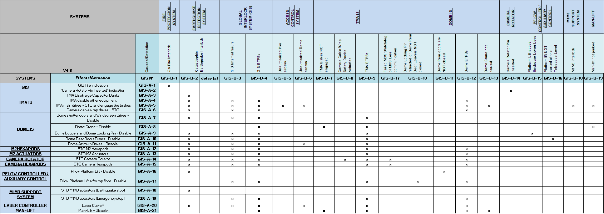

# PAS Connect Interface

<table>
<colgroup>
<col style="width: 31%" />
<col style="width: 68%" />
</colgroup>
<tbody>
<tr class="odd">
<td><blockquote>

Requested by:

</blockquote></td>
<td><blockquote>

<strong>LSST</strong>

</blockquote></td>
</tr>
<tr class="even">
<td><blockquote>

Code / Version:

</blockquote></td>
<td><blockquote>

7186_GIS_0010 / 1.0

</blockquote></td>
</tr>
<tr class="odd">
<td><blockquote>

Editor:

</blockquote></td>
<td><blockquote>

F. Javier López

</blockquote></td>
</tr>
<tr class="even">
<td><blockquote>

Approved by:

</blockquote></td>
<td><blockquote>

Ismael Ruiz de Argandoña

</blockquote></td>
</tr>
<tr class="odd">
<td><blockquote>

Date:

</blockquote></td>
<td><blockquote>

02/09/2022

</blockquote></td>
</tr>
</tbody>
</table>

## Index

1\. Introduction [4](#introduction)

2\. Reference document list [6](#reference-document-list)

3\. Communication GIS-Subsystems controller [6](#communication-gis-subsystems-controller)

3.1 ICD GIS-TMA [6](#icd-gis-tma)

3.2 ICD GIS-M1M3 [7](#icd-gis-m1m3)

3.3 ICS GIS-DOME [7](#ics-gis-dome)

3.4 ICS GIS-AUX-TEL [7](#ics-gis-aux-tel)

## Document history

<table>
<colgroup>
<col style="width: 14%" />
<col style="width: 14%" />
<col style="width: 18%" />
<col style="width: 53%" />
</colgroup>
<tbody>
<tr class="odd">
<td><strong>VERSION</strong></td>
<td><strong>DATE</strong></td>
<td><strong>EDITOR</strong></td>
<td><strong>COMMENTS</strong></td>
</tr>
<tr class="even">
<td>1.0</td>
<td>2022/09/02</td>
<td>F. Javier López</td>
<td><blockquote>

<em>Initial release</em>

</blockquote></td>
</tr>
<tr class="odd">
<td></td>
<td></td>
<td></td>
<td></td>
</tr>
<tr class="even">
<td></td>
<td></td>
<td></td>
<td></td>
</tr>
<tr class="odd">
<td></td>
<td></td>
<td></td>
<td></td>
</tr>
<tr class="even">
<td></td>
<td></td>
<td></td>
<td></td>
</tr>
</tbody>
</table>

<table>
<colgroup>
<col style="width: 15%" />
<col style="width: 84%" />
</colgroup>
<thead>
<tr class="header">
<th><strong>Acronyms</strong></th>
<th><strong>Definition</strong></th>
</tr>
<tr class="odd">
<th>
AFE / AcFiEa

ETPB
</th>
<th>
Access Fire Earthquake

Emergency trip pushbutton
</th>
</tr>
<tr class="header">
<th>GIS</th>
<th>Global Interlock System</th>
</tr>
<tr class="odd">
<th>HMI</th>
<th>Human Machine Interface</th>
</tr>
<tr class="header">
<th>
IS

LAS
</th>
<th>
Interlock System

LASER
</th>
</tr>
<tr class="odd">
<th>
LSST

UI
</th>
<th>
Large Synoptic Survey Telescope

User Interface
</th>
</tr>
</thead>
<tbody>
</tbody>
</table>

## Introduction

This document contains the signals communicated between the different CPUs that make up the telescope\'s safety system.

The safety CPUs in the telescope are:

-   GIS, central controller

-   TMA-IS

-   M1M3-IS

-   DOME_IS

-   AUX-IS

This interface has been made based on the I/O map defined in the GIS Table_v_4.xlsx, included in 092-308-E-Z_0004
document.

## Reference document list

<table>
<colgroup>
<col style="width: 5%" />
<col style="width: 57%" />
<col style="width: 18%" />
<col style="width: 18%" />
</colgroup>
<tbody>
<tr class="odd">
<td><strong>No.</strong></td>
<td><strong>DOCUMENT</strong></td>
<td><strong>CODE</strong></td>
<td><strong>VERSION</strong></td>
</tr>
<tr class="even">
<td><strong>1</strong></td>
<td><blockquote>

GLOBAL INTERLOCK SYSTEM (GIS) ANALYSIS

</blockquote></td>
<td>092-308-E-Z-00004</td>
<td>04</td>
</tr>
<tr class="odd">
<td><strong>2</strong></td>
<td><blockquote>

GIS Table_v_4_xlsx

</blockquote></td>
<td>092-308-E-Z-00004</td>
<td>04</td>
</tr>
<tr class="even">
<td><strong>3</strong></td>
<td><blockquote>

Electric schemes – 7186 Test System for GISS_LSST Cabinets

</blockquote></td>
<td><em>7186_GIS_0003</em></td>
<td>1.0</td>
</tr>
<tr class="odd">
<td><strong>4</strong></td>
<td><blockquote>

Electric schemes - 7186 LSST Global Safety Interlock System Design

</blockquote></td>
<td><em>7186_GIS_0001</em></td>
<td>1.0</td>
</tr>
<tr class="even">
<td><strong>5</strong></td>
<td><blockquote>

PASconnect Integration

</blockquote></td>
<td><em>7186_GIS_0006</em></td>
<td>2.0</td>
</tr>
</tbody>
</table>

## Communication GIS-Subsystems controller

The communication structure is vertical, it is only possible to link each CPU with the main controller and horizontal
communication between the subsystem controllers is not contemplated.

### ICD GIS-TMA

Inputs to GIS

-   GIS_D_7 TMA brakes NOT engaged

-   GIS_D_8 Camera cable wrap safety device activated

-   GIS_D_9 TMA ETPBs

-   GIS_D_17 Failed MCS watchdog or MCS loss communication

Output from GIS:

-   GIS_A_3 TMA Discharge Capacitors bank

-   GIS_A_4 TMA Disable other equipment

-   GIS_A_5 TMA main drives, STO and engage the brakes

-   GIS_A_6 Camera cable wrap drives STO

### ICD GIS-M1M3

Inputs to GIS

-   GIS_D_18 M1M3 Interlock

Output from GIS:

-   GIS_A_18 M1M3 drives STO with Earthquake signal

-   GIS_A_19 M1M3 drives STO with Emergency stop

### ICS GIS-DOME

Inputs to GIS

-   GIS_D_10 Dome Locking Pin retracted or Dome Rear Door Louvers NOT closed

-   GIS_D_11 Dome Rear doors are NOT closed

-   GIS_D_12 Dome ETPBs

-   GIS_D_13 Dome Crane not parkerd

Output from GIS:

-   GIS_A_7 Dome shutter and Windscreen drives STO or Disable

-   GIS_A_8 Dome crane drives STO or Disable

-   GIS_A_9 Dome Louvers and Dome Locking pin drives STO or Disable

-   GIS_A_10 Dome Rear Doors drives STO or Disable

-   GIS_A_11 Dome Azimuth drives STO or Disable

### ICS GIS-AUX-TEL

In principle, the auxiliary telescope only needs to know the earthquake signal, so as not to duplicate the detector.
This signal can be wired directly via a safe digital output of the GIS and in that case a SafetyNet communication with
the GIS is not necessary. The other alternative is to establish the SafetyNet connection and define a communicated
variable. In this case the ICD could be defined as,

Output from GIS:

-   GIS_A_22 Auxiliar telescope general STO
